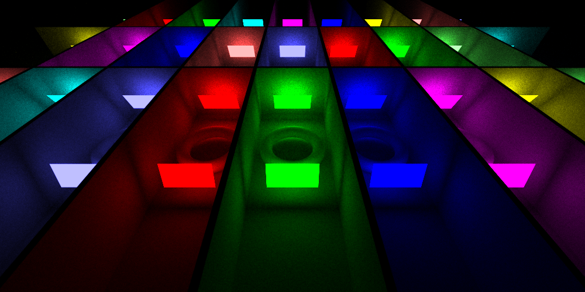

# Path Tracer

Live demo: [https://dennis.life/demo/pathtracer](https://dennis.life/demo/pathtracer) (Definitely runs in Google Chrome on Win10)

This is a path tracer written in Rust, intended to be compiled into WebAssembly (WASM). The included TypeScript Web App periodically invokes the WASM path tracer, and provides a GUI to interact with it.

This project was written as a research prototype for the Utrecht University course [Advanced Graphics](http://www.cs.uu.nl/docs/vakken/magr/2019-2020/index.html).



## 0. Changes
The raytracer is converted to a path tracer. This path tracer contains the following special features:
* Photon-Based Next Event Estimation - Prior to path tracing the scene, photons are sent from the light sources into the scene. These photons are used to find the most-contributing light sources for any particular hit point. (See file `src/data/photon_tree.rs` and `src/tracer.rs`)
* Adaptive Sampling - Samples are mainly taken for pixels that need it the most. (E.g. wherever the most noise and fireflies are - See file `src/graphics/sampling_strategy.rs`)

## 1. Running
Compiling the application yourself can be a bit troublesome, as compilers for *three* languages (TypeScript, Rust, Elm) need to be present.

> If no changes are made, I recommend using the live demo website listed at the top.

If you do compile it yourself, follow the steps below.
### Installing Elm
The Elm compiler can be downloaded through NPM. NPM is distributed with Node.js .

* [Node.js](https://nodejs.org/en/download/)

Then install Elm globally with:
```
npm install -g elm
```

### Installing Webpack
Webpack is used to compile and bundle all targets. The compile scripts are made for Webpack. Install Webpack globally as follows:
```
npm install -g webpack webpack-cli
```

### Installing Rust
The Rust compiler can be downloaded from:

* [Rust](https://www.rust-lang.org/)

The Nightly Rust build is required, as SIMD instructions are currently experimental. For this, run: `rustup default nightly`.

### Compiling
Now all necessary system-wide tools should be available. Any other tools/libraries should be obtainable as part of the project's `npm` setup process. Inside the root of this project invoke:
```
npm install
```
This installs all local dependencies (into the `node_modules/` directory). To run the project in dev-mode, invoke:
```
npm run serve
```
This starts a HTTP server at [https://localhost:9000/](https://localhost:9000/), with the project running.

## 2. Interacting
> Note that the application may not run in all browsers. It surely works in Google Chrome, but (especially multi-threading) may not work in other browsers. Be aware of this.

The GUI buttons on the righthand-side are rather self-explanatory. Further controls are:

* WASD + PageUp + PageDown *translate* the camera
* Arrow keys *rotate* the camera

## 3. Code Navigation
The main architecture is divided between the TypeScript part and the Rust part. Rust implements the actual tracing of rays into (hardcoded) scenes. The TypeScript part handles the GUI (buttons + controls), and guides the multi-threading (as browsers can only multi-thread through WebWorkers). The general structure of both parts is outlines below:

### Rust Source
The Rust sourcecode is located in the `src` directory. Some important files are described below.

* `lib.rs` - The compilation entry point of the application (not really important)
* `wasm_interface.rs` - All *public-interface* functions. All functions that are called by TypeScript are placed here.
* `tracer.rs` - Contains code for tracing a single ray (recursively) into a scene
* `scenes.rs` - The hardcoded scenes
* `main.rs` - The entry-point when *not* compiling to WebAssembly (but to native). Used for debugging and benchmarking.
* `data/photon_tree.rs` - An octree for storing photons. All nodes contain a CDF for the contributing light sources
* `graphics/`
  * `scene.rs` - General scene description. Contains methods for tracing rays (and shadow rays) into the scene. Also contains code for traversing the BVH.
  * `material.rs` - The material class (reflection, diffuse, refraction; potentially with textures)
  * `bvh.rs` - Constructs a 2-way BVH
  * `bvh4.rs` - Collapses a 4-way BVH to a 2-way BVH
  * `sampling_strategy.rs` - Contains the random and adaptive sampling strategies
  * `primitives/` - Contains all implemented primitives (each implements `Tracable` from `graphics/ray.rs`)

### TypeScript Source
The TypeScript sourcecode mainly deals with the GUI and the properly spawning of WebWorkers to attain proper multi-threading.

> Regarding multi-threading: The WASM module is compiled once, and then passed onto 8 WebWorkers. Each of these WebWorkers gets a random subset (partition) of the pixels in the scene. Once all WebWorkers (running the WASM module) are done with raytracing for their pixels, the resulting buffer is written to the screen by the main thread.

Some important files are described below.

* `client/` - The code running on the main thread
  * `index.ts` - The "main" file
* `shared/` - Library code that is shared (w.r.t. the compiler) between the main thread and the workers
* `worker/` - Code that is running on the webworker
  * `worker.ts` - The "main" file for the webworker. Mainly contains code to handle messages from the main thread

## 4. Credit
* [wasm-bindgen hello world example](https://github.com/rustwasm/wasm-bindgen/tree/master/examples/hello_world) - Setup for Rust to WASM with Webpack
* [Scratchapixel](https://www.scratchapixel.com/) - Nice explanation on refraction and fresnel
* [demofox.org - Raytracing](https://blog.demofox.org/2017/01/09/raytracing-reflection-refraction-fresnel-total-internal-reflection-and-beers-law/) - Explanation on refraction and Beer's law
* [Torus ray intersection](http://cosinekitty.com/raytrace/chapter13_torus.html)
* [My old raytracer](https://github.com/dennis-school/raytrace_city/) - This I wrote during my BSc ([RuG - Computer Graphics](http://www.cs.rug.nl/svcg/Teaching/ComputerGraphics)), from which I reused some primitive intersection code (some of which I probably took from the course slides or provided code templates).
* "Shallow Bounding Volume Hierarchies for Fast SIMD Ray Tracing of Incoherent Rays" by H. Dammertz and J. Hanika and A. Keller - On 4-way BVH SIMD structures
* "Adaptive Collapsing on Bounding Volume Hierarchies for Ray-Tracing" by A. Susano Pinto - On 2-way BVH collapsing
* "Stanford bunny" by G. Turk and M. Levoy
* "Efficient data structures and sampling of many light sources for Next Event Estimation" by Andreas Mikolajewski - On the PNEE
* "Adaptive Sampling and Reconstruction using Greedy Error Minimization" by F. Rousselle, C. Knaus, and M. Zwicker - On Adaptive Sampling
* Utrecht University course slides for [Advanced Graphics](http://www.cs.uu.nl/docs/vakken/magr/2019-2020/index.html).

## 5. License
The included [fonts](https://fonts.google.com/specimen/Open+Sans) (which I absolutely needed) were published under the [Apache License, Version 2.0](http://www.apache.org/licenses/LICENSE-2.0).
